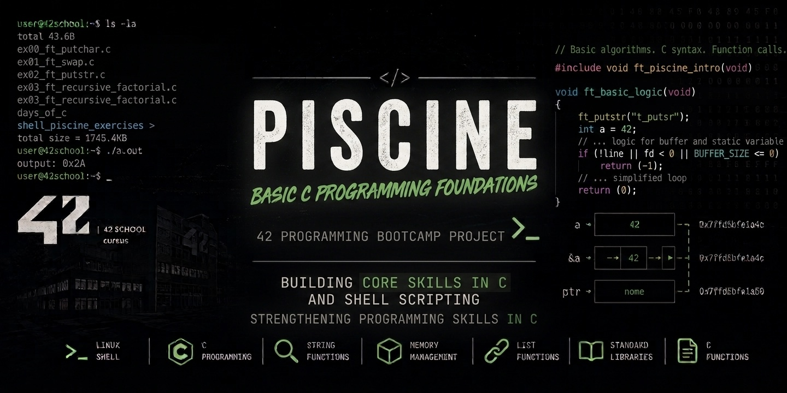

<p align="center">
  
</p>

<p align="center">
  
  
  
  
  
</p>

<h1 align="center">🧠 42 Piscine – C Language & Unix Foundations</h1>

<p align="center">
  <strong>Low-Level Programming as a Foundation for Cybersecurity Thinking</strong>
</p>

<p align="center">
  A structured collection of exercises developed during the 42 Piscine, focusing on C programming, memory manipulation, and Unix systems fundamentals — essential building blocks for cybersecurity and systems understanding.
</p>

---

## 📖 About

This repository contains all exercises completed during the 42 Piscine, an intensive programming bootcamp from :contentReference[oaicite:0]{index=0}.

The Piscine is designed to train developers in **low-level thinking, strict coding discipline, and problem-solving under constraints**, with no external libraries and full focus on understanding how software behaves at the system level.

From a cybersecurity perspective, this experience builds the foundation to understand:
- how memory is structured and manipulated
- how vulnerabilities can emerge from low-level code
- how Unix systems execute and manage processes
- how programs behave beyond high-level abstractions

---

## 🎯 Cybersecurity-Oriented Learning Objectives

Throughout this Piscine, I developed core competencies that directly support cybersecurity fundamentals:

### 🧠 Memory & Low-Level Understanding
- Deep understanding of **stack vs heap memory**
- Pointer manipulation and memory addressing
- Manual memory reasoning without abstractions
- Awareness of memory safety risks (overflow, invalid access)

### ⚙️ C Programming & System Logic
- Writing C programs without external libraries
- Building logic from scratch under strict constraints
- Understanding compilation, linking, and execution flow
- Debugging segmentation faults and undefined behavior

### 🐚 Unix & System Environment
- Navigation and control of Unix/Linux systems
- File permissions and execution contexts
- Shell scripting for automation
- Understanding process execution at a system level

### 🔐 Security-Relevant Mindset
- Recognizing unsafe memory patterns
- Understanding how low-level bugs can become vulnerabilities
- Developing attention to detail in input handling
- Thinking like both developer and attacker (defensive awareness)

---

## 🧩 Technical Skills Demonstrated

### 💻 Systems Programming
- C language fundamentals
- Pointers and memory manipulation
- Stack & heap behavior
- Static memory vs dynamic allocation
- Low-level debugging techniques

### 🧪 Algorithmic Thinking
- Recursion and iteration
- String and array manipulation
- Mathematical logic implementation
- Constraint-based problem solving

### 🐧 Unix & Shell
- Bash scripting
- File system operations
- Permissions and execution rights
- Command-line workflow

### 🛠️ Software Engineering Discipline
- Modular code structure
- Clean function design
- Strict compilation rules (Werror/Wextra/Wall)
- Incremental testing and debugging

---

## 📁 Project Structure

```text
Piscine/
├── C00/
├── C01/
├── C02/
├── C03/
├── C04/
├── C05/
├── C06/
├── shell_00/
├── shell_01/
